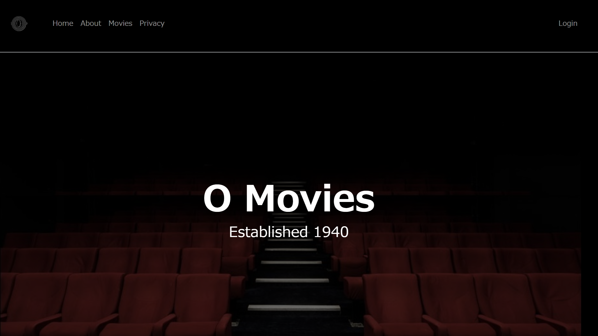
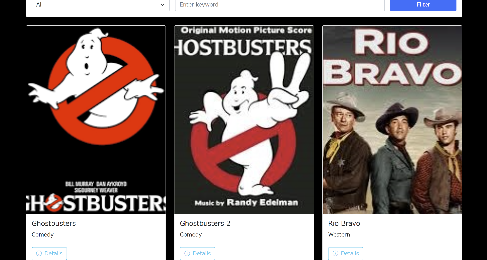
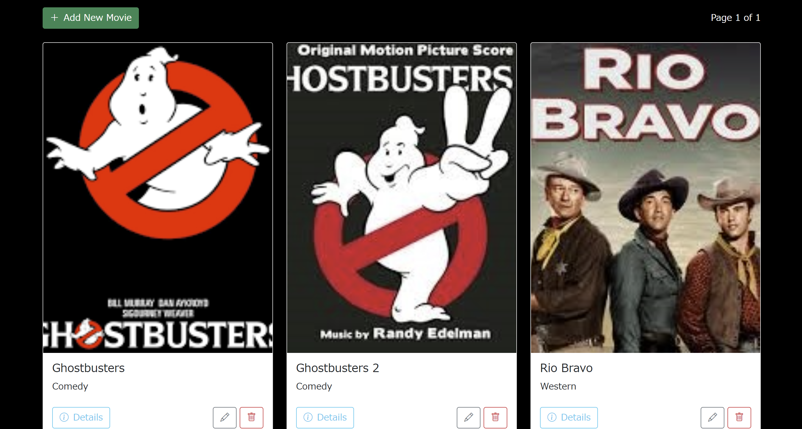

# O Movies

<p align="center">
    
</p>

## Description

O Movies is a fictional theater that offers classic movies.  
The application provides user management based on roles and features various functionalities, allowing guests to view movie listings and administrators to manage movie information.

## UI

### Home



---

### Guest Display


---



---

### Admin Display


---



## Developed with

- [.NET](https://github.com/dotnet)
- [ASP.NET Core](https://github.com/dotnet/aspnetcore)
- [Razor](https://github.com/dotnet/razor)
- C#

## Project build

```
dotnet build
```

## Project build and hot-reloads for dev

```
dotnet watch
```
